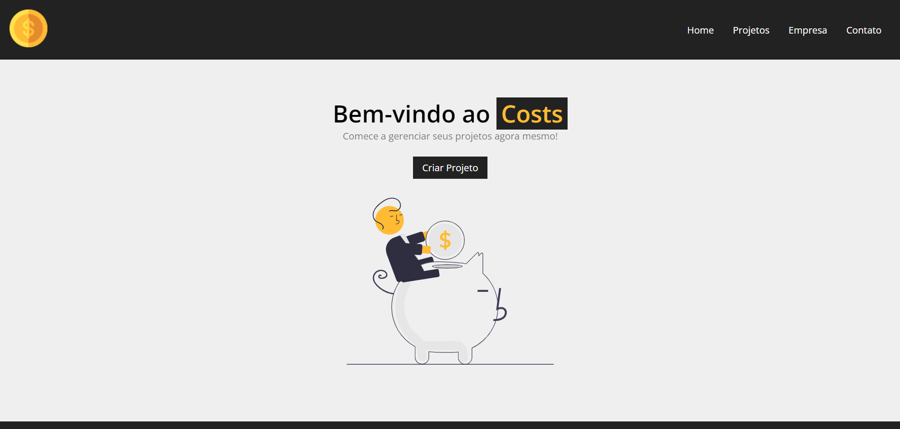
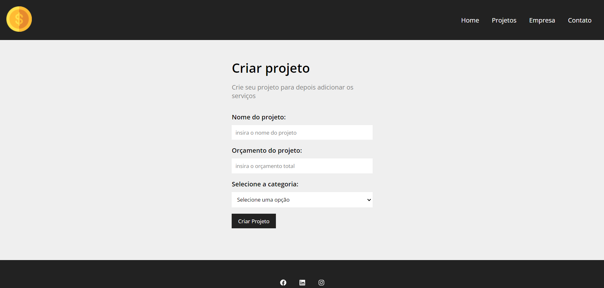
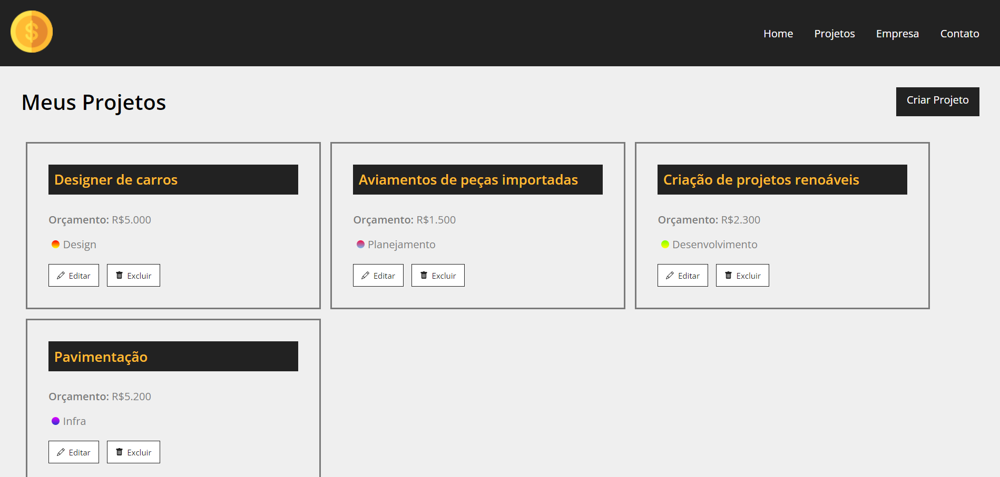
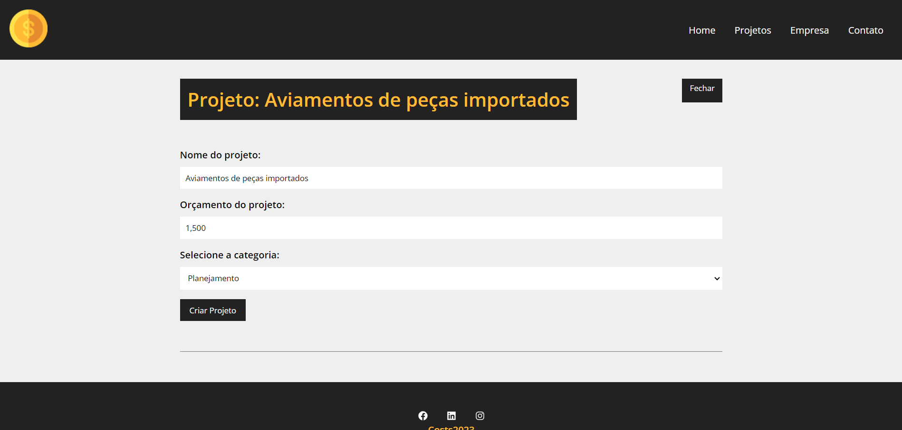

<h1 > 
  
  
Cost

</h1>

## About

**Cost** is a Project Manager made with React.js (in progress)
Costs allows you to manage your projects, defining budget, total project value, allocating services according to the budget value, controlling expenses.
### Home:
<h1> 
  
</h1>

### Creating Project:
<h1>
    
</h1>

### Projects:
<h1>
    
</h1>

### Edit your Projcts:
<h1>
    
</h1>

## Tools

- [node.js](https://nodejs.org/en)
- [React.js](https://react.dev/)
- [Vite](https://vitejs.dev/)

## Dependencies

- [React-router-dom](https://beta.reactrouter.com/en/main/start/overview)
- [React Hooks](https://react.dev/reference/react) (useState e useEffect)
- [React-icons](https://react-icons.github.io/react-icons/)
- [Json-Server](https://www.npmjs.com/package/json-server)